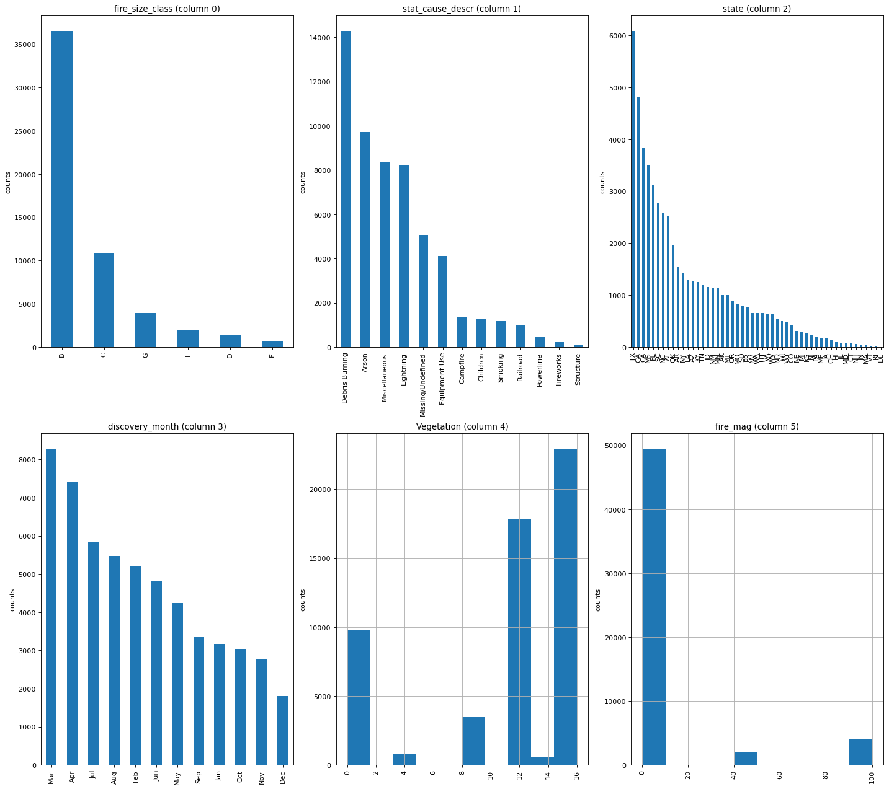

# Prediction of Wildfires

# Introduction

Wildfires are one of the most devastating natural disasters that take place on a regular basis. With a large number of fires burning at the same period during the peak seasons, the fire departments are always forced to make hard choices between which fire to put out or which land to protect. The wildfires also have disturbing effects on the daily life of folks living in the nearby area. Local authorities have to make decisions to evacuate millions every year. The goal of this project is to use machine learning to help preparation and adjusting the focus.

The dataset [5] is a sub-sample of data:[1.88 Million US Fires](https://www.kaggle.com/rtatman/188-million-us-wildfires) [1]. The dataset was selected to a random sampling of 50,000 fire samples and combined this dataset with historical weather data at a specific lat/long [2], historical vegetation data [3]. A metric is representing the measure of the remoteness of a fire using city lat/long database [4]. The source of the data set comes from the following sites and references.

[1] Short, Karen C. 2017. Spatial wildfire occurrence data for the United States, 1992-2015 [FPA_FOD_20170508]. 4th Edition. Fort Collins, CO: Forest Service Research Data Archive. [https://doi.org/10.2737/RDS-2013-0009.4](https://doi.org/10.2737/RDS-2013-0009.4)

[2] NOAA National Centers for Environmental Information (2001): Integrated Surface Hourly [1992-2015] - [ftp://ftp.ncdc.noaa.gov/pub/data/noaa/](ftp://ftp.ncdc.noaa.gov/pub/data/noaa/)

[3] Meiyappan, Prasanth, and Atul K. Jain. "Three distinct global estimates of historical land-cover change and land-use conversions for over 200 years." Frontiers of Earth Science 6.2 (2012): 122-139.

[4] "World Cities Database." Simplemaps, simplemaps.com/data/world-cities.

[5] "U.S. Wildfire data" Kaggle, [https://www.kaggle.com/datasets/capcloudcoder/us-wildfire-data-plus-other-attributes](https://www.kaggle.com/datasets/capcloudcoder/us-wildfire-data-plus-other-attributes)

# Data cleaning

The dataset contains several types of features:

- Fire id
- Fire size: fire size, fire size class, fire magnitude
- Geographical information: longitude, latitude, State, remoteness to nearby city
- Datetime information: discover date, time, putout time
- Vegetation and cause description
- Weather information: 30 days, 15 days, 7 days, and same day weather information, including,
    - Temperature
    - Wind
    - Precipitation
    - Humidity

<aside>
💡 We drop the features that can hardly be used to build the machine learning model. These features are, 
Fire id: 'Unnamed: 0.1', 'Unnamed: 0', 'wstation_usaf', 'dstation_m', 'wstation_wban', 'wstation_byear', 'wstation_eyear’
History datetime information: 'disc_date_pre', 'disc_pre_year', 'disc_pre_month'

</aside>

We created new features and changed them to ‘datetime’ format.

- Discovery year
- Discovery month
- Convert putout_time to hours

Based on the monthly fire data, we created a time series of monthly fire occurence.

# Descriptive Analysis

For descriptive analysis, we plot the histogram of fire size class, and description of cause, fire magnitude, Vegetation, and discovery month. We also plotted the distribution of fire incidents of each states.

1. We displayed the histogram or distribution for unique values of each column. For simplicity, only columns that have less than 100 unique values will be plotted. Based on the histogram of fire_size_class and fire_mag, we find the data of fire magnitude is highly skewed and imbalanced. Thus we will choose fire_size_class.



1. We plotted the correlation matrix. The most correlated features are those weather data, which indicates multicollinearity**.** For the regression problem, we will check their importance by using the t-test.


## Clustering classification

We use k-means to classify the fire information, including,

- Cause description
- Fire size
- Geographical information
- Weather information
- Vegetation

The ****n_clusters**** was identified by the elbow distortion curve.


1. We illustrate the geographical information of the fires. While the class-0 fires are nationwide, the class-2 fires are concentrated in Alaska and midwest.


1. We also plot the distribution of the ‘fire size class’ in each k-means group to descriptively analyze each class. While group-0 have more evenly distributed incidents in each fire size class, the group-1, and 2 only describe the largest fire. 


1. The next chart is about the histogram of cause description. We create the dictionary for cause description. ****Based on the classification of fire size, we find the the most probably reason for the largest sized fires are lightening.
    
    {0: 'Arson', 1: 'Campfire', 2: 'Children', 3: 'Debris Burning', 4: 'Equipment Use', 5: 'Fireworks', 6: 'Lightning', 7: 'Miscellaneous', 8: 'Missing/Undefined', 9: 'Powerline', 10: 'Railroad', 11: 'Smoking', 12: 'Structure'}
    


1. Vegetation has an positive in containing the fire, which wins precious time for the firefighters to put out the wildfires. Based on the k-means classification. In group-2, the most dominant vegetation is ‘Tropical Evergreen Broadleaf Forest’, probably correlated with the geographical distribution of group-2 fires. In group-1, the most common vegetation is ‘Polar Desert/Rock/Ice’, which does not stop fires at all.


1. To illustrate the weather data of each k-means cluster, we created the scatter plot by using two of the principal components of weather data. These two PCs accounts for 80% percent of the total variance of features. The cluster-2 fires has the smallest variance on the scatter plot, which implies the specific climate behind these fires might be a major cause of these wide spread fires.


# Regression Model for Predicting the Fire Size

## Linear Regression

We experiment the linear regression model to predict the ‘fire size’ based on the weather data and ‘remoteness from city’ data. We used the t-test to test the null hypothesis of coefficients if a feature is one of the regressors. We finally selected the features, ‘fire_size ~ Temp_pre_30 + Temp_pre_7 + Temp_cont + Hum_pre_7 + Hum_cont + Prec_cont + remoteness’. The linear regression model might not be the best predictive model for the dataset because of their multicollinearity. One way to improve the prediction is to implement the regularization, ie. Ridge regression with the aid of a L2 regularization term of the cost function. For the R2 score is too low, we took other approaches.

```
OLS Regression Results                            
==============================================================================
Dep. Variable:              fire_size   R-squared:                       0.052
Model:                            OLS   Adj. R-squared:                  0.051
Method:                 Least Squares   F-statistic:                     80.75
Date:                Thu, 26 Oct 2023   Prob (F-statistic):          5.43e-274
Time:                        23:52:36   Log-Likelihood:            -2.8549e+05
No. Observations:               25133   AIC:                         5.710e+05
Df Residuals:                   25115   BIC:                         5.712e+05
Df Model:                          17                                         
Covariance Type:            nonrobust                                         
===============================================================================
                  coef    std err          t      P>|t|      [0.025      0.975]
-------------------------------------------------------------------------------
Intercept    2860.1303    325.453      8.788      0.000    2222.223    3498.038
Temp_pre_30  -150.4706     66.603     -2.259      0.024    -281.017     -19.925
Temp_pre_15     2.0914     96.067      0.022      0.983    -186.205     190.388
Temp_pre_7    128.4709     63.993      2.008      0.045       3.040     253.901
Temp_cont     309.3622     33.139      9.335      0.000     244.408     374.316
Wind_pre_30  -228.8781    328.963     -0.696      0.487    -873.665     415.909
Wind_pre_15   -30.6629    417.113     -0.074      0.941    -848.229     786.903
Wind_pre_7    154.1538    268.717      0.574      0.566    -372.547     680.855
Wind_cont    -167.8755    170.448     -0.985      0.325    -501.964     166.213
Hum_pre_30     -3.5233     17.445     -0.202      0.840     -37.716      30.669
Hum_pre_15     24.4047     25.977      0.939      0.347     -26.511      75.320
...
==============================================================================
```

## **XGBoost Regression**

We choose the tree model to make the predictive regression for ‘fire size’ data. A tree model doesn’t use all the feature to make the split so they are better for correlated features. The preferable tree model in this case will be the XGBoost Regression which boosts the gradient further. To simplify the trees, we used the following features based on their importance scores. 


We used cross validation and searched for the best hyperparameters for XGBoost, such as boost interations, learning rate, max depth of the tree. The accuracy of the final model reached at the R2 = 0.7 compared to R2 = 0.05 of the linear regression model. The final model of the XGBoost regression tree is illustrated.


# Classification of Fire Size

We compared the Random Forest classification tree and XGBoost classifier. Gradient boost method is specially better for the imbalanced data set, it stops constructing a tree if the information gain at a node is minimal. But we still need to use the GridSearch with cross validation to optimize the hyperparameter and most importantly, assigning the weights for imbalanced data in each class and choose a good evaluation metric.

The metric we choose for cross validation is **precision**, the best in ****Scikit-learn package. Preferably, we would use the area under the curve of precision-recall (aucpr) which only the XGBoost offers.

We computed the weight for each sample in the training set from the population of each class. This step significantly improved the accuracy of prediction for the imbalanced dataset.

We also computed the importance score for each feature, the most important ones are the historical weather data and ‘remoteness’.

Finally we reached the near 1.00 accuracy score and F1 on a small testing dataset.


# Occurence Prediction with ARIMA

ARIMA is one of the best model to analyze the time series. We took three different approaches to train the ARIMA model of the time series started from Jan/2001 to Dec/2012. 

## ARIMA

First, we tested the null root by Adfuller test. The series of training data is stationary, which implies that the order of differencing (d) is low. From the difference graph of zero-th and first order (d = 0, 1), we choose d = 0 manually.

Next, we search for the order parameter of ARMA with the original series(d=0). With the estimate (p, q) from the partial autocorrelation and autocorrelation graph, we set the ARIMA for fitting the data.

Finally, the forcasted series for the year of 2013 was highlighted in the box. The ARIMA predicted the trend of the 1year cycle. It needs improvement further for the time series has seasonality.


## ARIMA with Seasonal Decomposition

In the second approach, we removed the seasonality from the training stage and we added it back in the prediction stage to make better prediction. Avoiding the seasonality significantly improved the accuracy of the ARIMA.

First, we depicted the 12-month rolling average of the training data and compared it with the seasonal decomposition.


Training data is composed of the trend and residue, where the trend series illustrates the 12-month rolling avg

We compared the rolling avg of the training series with the trend series from seasonal decomposition.


Trend series of the training data


Seasonal series has a cycle of 12 months

Next, we fit the data with the removal of seasonality. We fit the model and made a 12 month prediction.


## SARIMAX

In the third approach, we used the grid search of SRIMAX with the cycle of 12 to fit the training set. The best order parameters are determined by minimizing the AIC. The forecast was made for the 36 months with the confidence interval of the prediction illustrated in the chart.

